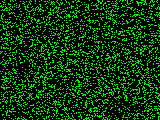

# Conway's Game of life kata

## Intro

Code kata based on [Conway's Game of life](https://en.wikipedia.org/wiki/Conway's_Game_of_Life) rules ([nice summmary here](https://github.com/marcoemrich/game-of-life-rules/blob/master/gol_rules.pdf)). For deeper details check [LifeWiki](http://www.conwaylife.com/wiki/Main_Page).



Notes:

- Built with an iterative inside-out approach, so classes are meh (e.g. encapsulation is far from what I'd like, no `Cell` class, ...)
- TDD approach, only made the `game.py` at the end when rules were working
- Rewritten using a simple array and calculating coordinates like in the old times (`position = Y * width + X`), initially was a list of arrays but more legible for me this way (and of course getter and setter)
- Resolution and fullscreen handled at the end of `game.py` (when the main instance is created)
- To record the gif under Linux I used [Byzanz](https://www.maketecheasier.com/record-screen-as-animated-gif-ubuntu/)

An additional, more optimized version using a linebuffer method is present at `grid_linebuffer.py` and is used by default by `game.py`.

## Setup

Python (3.x) requirements:
```
pygame
mamba
doublex
expects
doublex-expects
```

To run:
```
python3 game.py
```

## Testing

```
mamba -f documentation test*.py
```
Or simply:
```
mamba test*.py
```
For constant feedback I like doing:
```
watch -n 1 mamba test*.py
```
